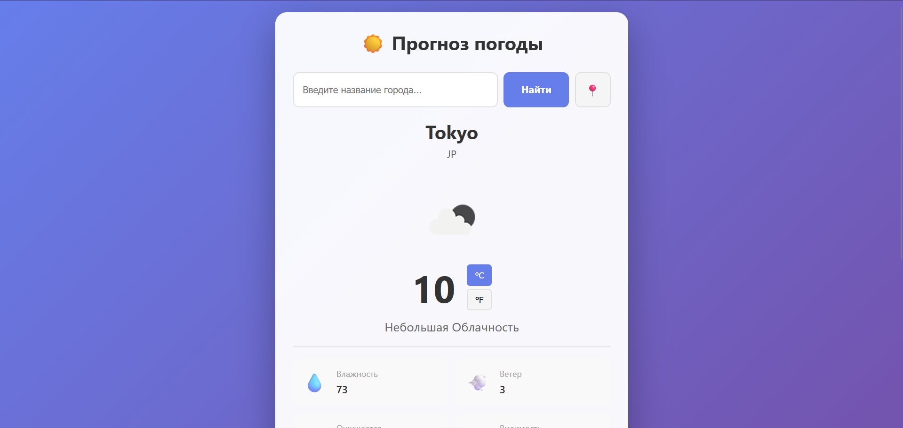
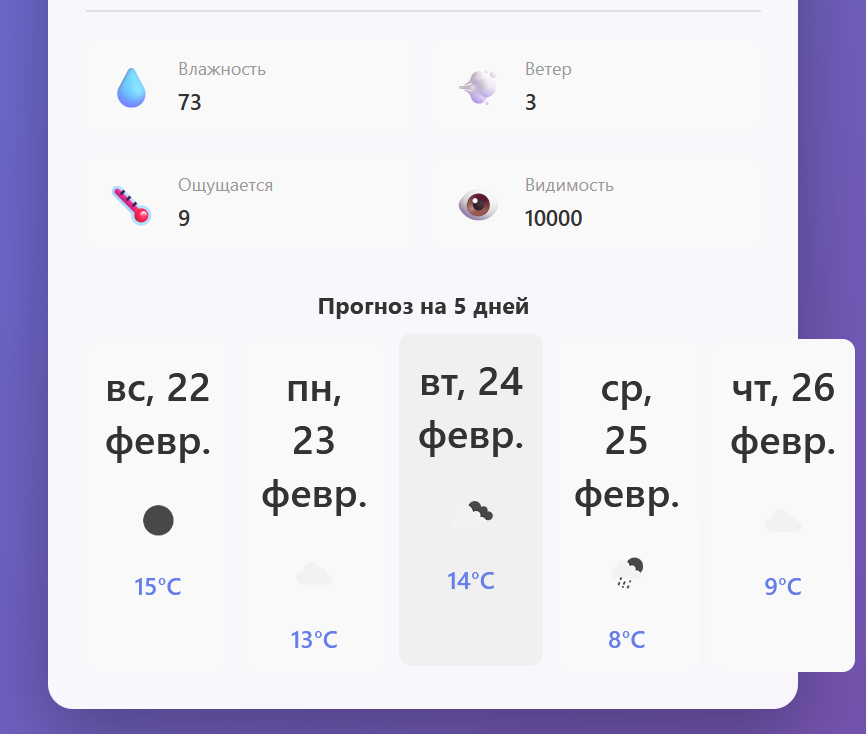

# Weather App 🌤️

A simple weather app to check current conditions and forecast.

## Features

- Temperature & feels like
- Wind speed & humidity
- Celsius to fahrenheit toggle
- Weather description & icon
- Weather forecast

## Demo

[weather-app-raz.vercel.app](https://weather-app-raz.vercel.app/)

## Screenshots

## Tech Stack

HTML · CSS · JavaScript · OpenWeatherMap API

## Getting Started

1. Clone the repo
2. Get a free API key at [openweathermap.org](https://openweathermap.org/)
3. Add your key to the config
4. Open `index.html` in your browser
